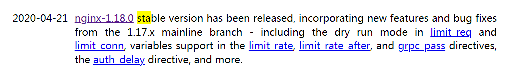
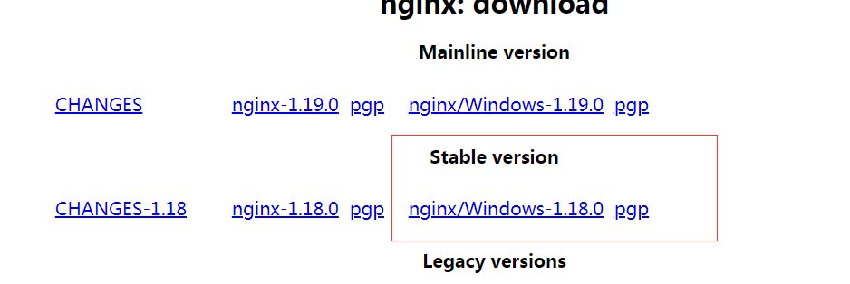

# supermall

## 1.划分目录结构

# 

### 图片的懒加载

vue-lazyload

### Window下载nginx

官方网站:https://nginx.org/

其中包含很多的nginx版本，大致可以分成三类：

Mainline version: Mainline 是Nginx目前主力在做的版本，可以说是开发板

Stable version:最新稳定版，生产环境上建议使用的版本

Legacy version:遗留的老版本的稳定版

